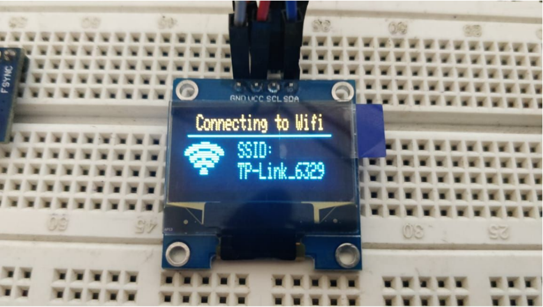
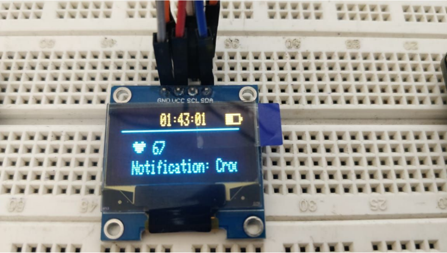

# IOT Based SmartWatch

NodeMCU based ESP8266 code in Lua for programming the LCD display and for connecting to the server

## Working

Here's a sample of the output on uploading the code to the NodeMCU 

## Contributing
Pull requests are welcome. For major changes, please open an issue first to discuss what you would like to change.

## License
[MIT](https://choosealicense.com/licenses/mit/)
