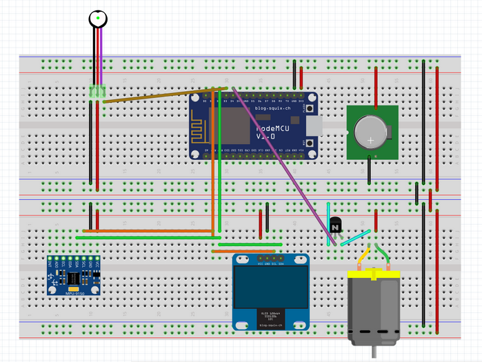

# IOT Based SmartWatch

NodeMCU based ESP8266 code in Lua for programming the LCD display and for connecting to the server

## Circuit Components

* **NodeMCU** - The main processing unit on the smartwatch, has Wi-Fi capabilities and can connect to the cloud through internet. It is capable of low-level hardware interaction as well using interacting with the world wide web. It enables our system to change configuration on the fly.

* **GY 9250 sensor** - A 9 Degree of Freedom(DOF) Inertial Measurement Unit(IMU), that is used for detecting the current position of the smartwatch. It is composed of an accelerometer, Gyroscope and Magnetometer. Using these sensors, it is possible to very precisely record and analyse the Gestures done by the hand.

* **Pulse Heartbeat Sensor** - A sensor to count the heartbeats. It uses the concept of Photoplethysmograph. The changes in the volume of blood in an organ is measured by the changes in the intensity of the light passing through that organ.

* **OLED screen** - Mini OLED with bright colours for the main display on the watch. Size used 0.96" (128 x 32 Dot Matrix)

* **3D printed case** - A Case to hold it all together. This is a custom printed case that is modelled in CAD. It is used as an enclosure for the smart watch. It will be, in future, downsized to make the device comfortable to use.

* **M to M wires and M to F wires** - Connectors for prototyping. This enable quick and easy changes to the circuit for checking a wide variety of components while in the testing and development phases.

* **Breadboard** - A solderless prototyping board. It is used in conjunction with the jumpers to enable quick prototyping.

* **USB to micro USB cable** - Used for programming and supplying power to the microcontrollers.

* **Battery Li-po and Alkaline** - A Rechargeable battery for final product.

* **Battery holder** - Simple Battery placeholder.

* **Arduino UNO** - A test - bench for sensors and displays.Arduino Uno is a microcontroller board based on the ATmega328P. Arduino is an open-source electronic prototyping platform enabling users to create interactive electronic objects.

* **Vibrator motor** - For Notifying the user about medication and other important details
Resistors

* **Resistor** - For the voltage bridge

## Working

Here's a sample of the output on uploading the code to the NodeMCU 

Here's an example of the circuit diagram

## Contributing
Pull requests are welcome. For major changes, please open an issue first to discuss what you would like to change.

## License
[MIT](https://choosealicense.com/licenses/mit/)
